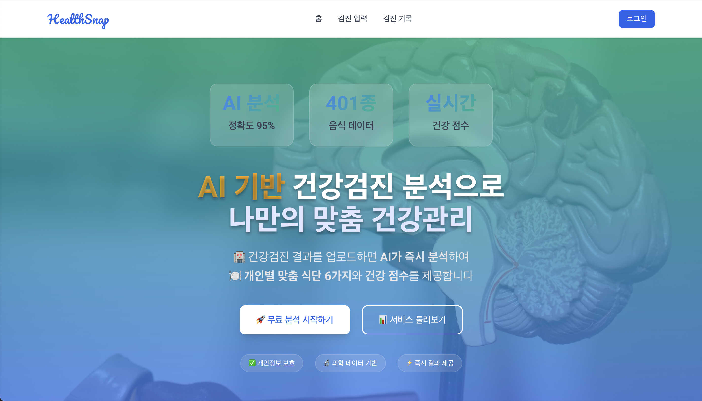
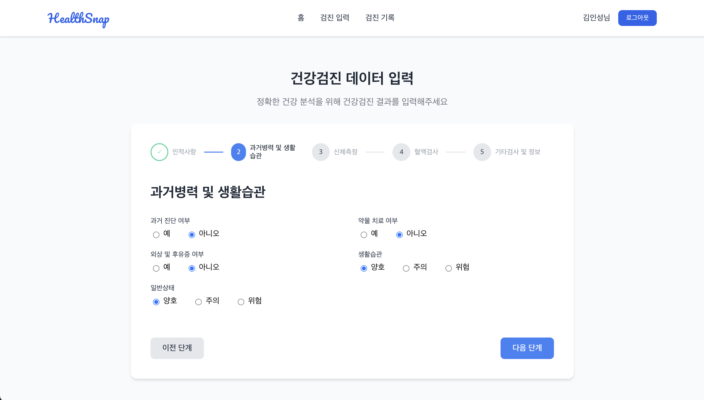
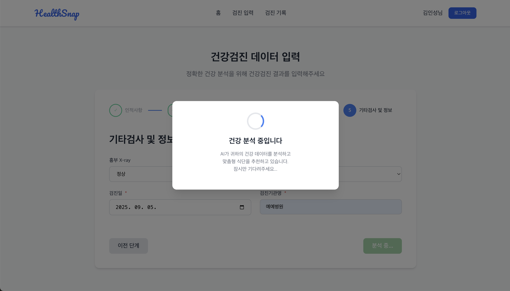
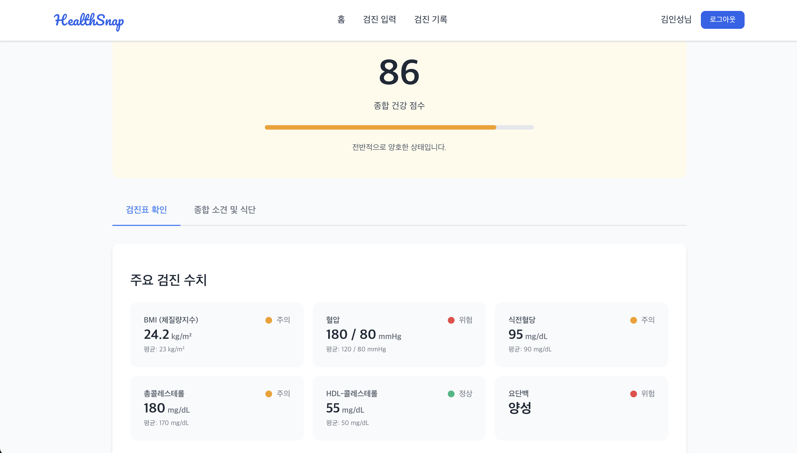
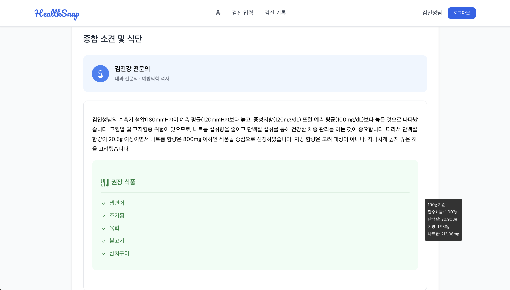
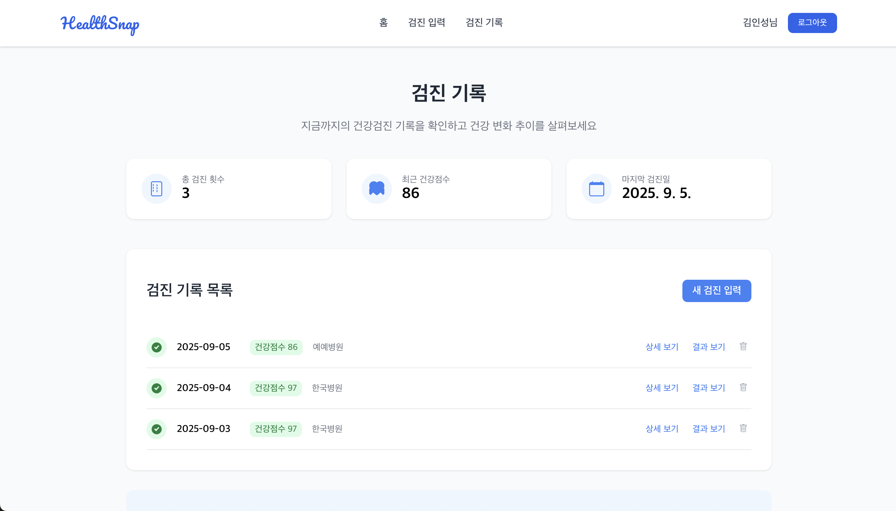
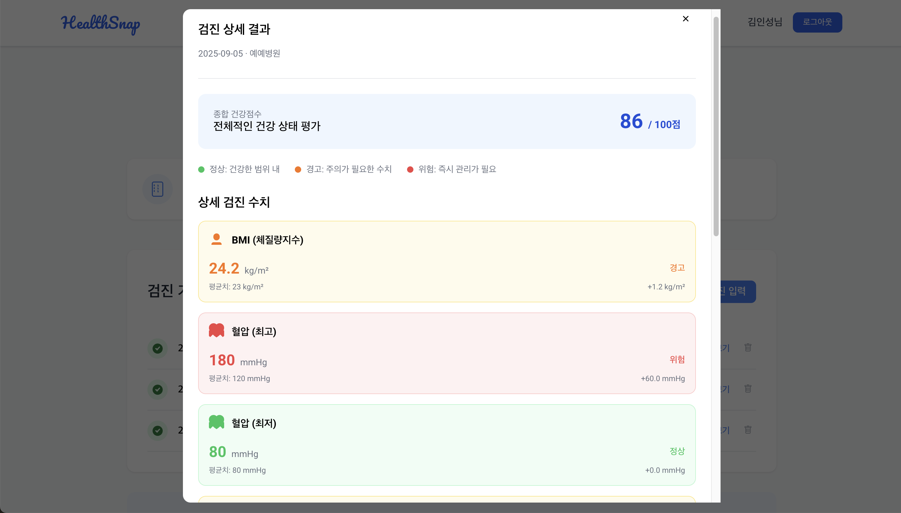
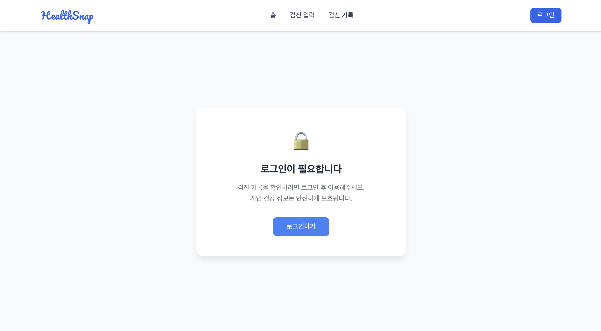

# 🍽️ HealthSnap - AI 기반 건강검진 분석 시스템

  

**건강검진 결과를 5분 만에 AI 분석하여 개인별 맞춤 식단을 추천하는 웹 서비스**

---

## 🌐 **라이브 데모 & 무료 배포 (24시간 접근)**
### 🚀 **지금 바로 체험하세요!**

**🔗 웹앱 URL: https://health-snap.kro.kr/**

---

## 👥 개발팀

본 프로젝트는 팀 협업을 통해 개발되었으며, 저는 프론트엔드 개발을 주도적으로 담당했습니다.

| 역할 | 개발자 | 주요 담당 업무 |
|------|--------|-----------|
| **🎯 팀장** | **김인성** [@Danto7632](https://github.com/Danto7632) | 데이터 전처리, 백엔드 개발, 프론트엔드 개선 |
| **💻 프론트엔드** | **박수현** [@park-soo-hyeon](https://github.com/park-soo-hyeon) | 사용자 인터페이스(UI) 설계 및 구현, 핵심 기능 프론트엔드 로직 개발, 백엔드 API 연동, 반응형 웹 디자인 적용 |

---

## 🚀 서비스 소개

### 🎬 시연 영상

 
<em>👆 클릭하여 HealthSnap 실제 동작 영상을 확인하세요!</em>

### 🎯 핵심 기능 (프론트엔드 관점)
- **⚡ 직관적인 5분 분석 UI**: 건강검진 결과 입력 후 즉시 AI 분석 결과를 시각적으로 제공하는 사용자 경험을 구현했습니다.
- **🤖 Gemini AI 연동**: Google 최신 AI 엔진과 효율적인 데이터 통신으로 정확한 건강 상태 평가 결과를 사용자에게 출력합니다.
- **🍽️ 맞춤 식단 추천 UI**: AI가 추천하는 개인화 식단을 사용자가 이해하기 쉽고 보기 좋게 제시합니다.
- **📊 건강 점수 시각화**: 복잡한 건강 지표를 0-100점의 명확한 점수로 시각화하여 전달력을 높였습니다.
- **🔐 개인화 서비스 경험**: JWT 인증을 통해 개인별 건강 이력 및 상세 정보를 안전하고 편리하게 관리하는 사용자 경험을 설계했습니다.

### 🎨 서비스 플로우 (UI/UX 관점)

| 1️⃣ 건강검진 입력 | 2️⃣ AI 분석 중 |
|:---:|:---:|
| |  |
| 사용자 친화적인 입력 폼 구현 | 실시간 로딩 애니메이션 및 메시지 제공 |

| 3️⃣ 분석 결과 | 4️⃣ 식단 추천 |
|:---:|:---:|
|  |  |
| 종합 건강 점수 및 AI 소견 시각화 | 개인 맞춤 식단 6가지 이내를 보기 쉽게 디자인 |

| 5️⃣ 검진 이력 | 6️⃣ 상세 분석 |
|:---:|:---:|
|  |  |
| 직관적인 검진 이력 관리 화면 | 상세 분석 결과 페이지 UI 구현 |

### 🔐 로그인 vs 비로그인 서비스 (프론트엔드 경험 차별화)
기능

| 기능 | 🌐 비로그인 사용자 | 🔒 로그인 사용자 |
|------|-------------------|------------------|
| **건강검진 입력** | ✅ 1단계부터 전체 입력 | ✅ 2단계부터 (기본정보 자동입력) |
| **AI 분석 결과** | ✅ 즉시 확인 가능 | ✅ 즉시 확인 + DB 저장 |
| **식단 추천** | ✅ 6가지 추천 확인 | ✅ 6가지 추천 + 영양정보 |
| **검진 기록** | ❌ "로그인 후 이용해주세요" 메시지 및 로그인 유도 UI 구현 | ✅ 개인별 이력 관리 및 히스토리 UI 제공 |
| **데이터 저장** | ❌ 일회성 분석만 | ✅ 영구 저장 및 트렌드 분석 |

📱 비로그인 이용 시 화면 (로그인 유도 UI)

  
   
  <em>비로그인 상태에서 검진 기록 접근 시 로그인 유도 화면을 구현하여 서비스 연속성을 높였습니다.</em>

---

## 🎨 프론트엔드 개발 (주요 기여 및 성과)

### 🏗️ 기술 스택
- **React 18**: 함수형 컴포넌트, **React Hooks**(useState, useEffect, useContext 등)를 활용한 상태 관리 및 비동기 로직 구현
- **TypeScript**: 타입 안정성을 확보하여 코드의 가독성과 유지보수성을 높이고, 런타임 에러를 방지
- **Context API**: JWT 인증 토큰 및 사용자 정보를 전역 상태로 관리하여 사용자 세션 유지 및 컴포넌트 간 데이터 공유
- **Rsbuild**: Vite 기반의 고속 번들링 도구를 활용하여 빠른 개발 서버 구동 및 최적화된 빌드 결과물 생성
- **반응형 CSS**: 모바일, 태블릿, 데스크톱 등 다양한 디바이스에 최적화된 사용자 인터페이스 구현 (Media Query, Flexbox, Grid)

### 🎯 주요 기여 및 기능 구현
- **UI/UX 설계 및 구현**: Figma 디자인 시안을 기반으로 모든 화면의 레이아웃 및 디자인 시스템을 React 컴포넌트로 구현했습니다.
- **인증 시스템 연동**: JWT 기반 백엔드 API와 프론트엔드의 로그인/회원가입/데이터 접근 인증 플로우를 완벽히 연동했습니다.
- **사용자 경험(UX) 개선**: 로딩 스피너, 에러 메시지 UI, 데이터 입력 유효성 검사 등 사용자 친화적인 피드백 시스템을 구축했습니다.
- **서비스 분기 로직**: 로그인/비로그인 상태를 전역으로 관리하여, 사용자를 구분하고 각각 다른 UI와 기능(데이터 저장, 이력 조회 등)을 제공하는 조건부 렌더링 로직을 구현했습니다.
- **API 연동 및 데이터 처리**: Axios를 활용하여 백엔드 API와 데이터를 비동기적으로 통신하는 로직을 구현하고, 응답 데이터를 가공하여 화면에 렌더링했습니다.
- **페이지 라우팅**: React Router를 사용하여 SPA(Single Page Application)의 효율적인 페이지 전환 및 URL을 관리했습니다.

  
## 
📊 백엔드 및 데이터 관련 정보 (참고용)

- **데이터 처리**: 팀원이 Python을 사용하여 약 6GB의 AI-Hub 원본 데이터를 732KB로 압축 및 정제하여 API 서버에서 사용할 수 있도록 처리했습니다.
- **백엔드 API**: 팀원이 NestJS와 TypeORM을 사용하여 사용자 인증, AI 분석 요청, 데이터베이스 연동을 처리하는 RESTful API를 개발했습니다.
- **데이터베이스**: 개발 단계에서는 SQLite를 사용했으며, 배포 환경에서는 Neon의 Serverless PostgreSQL을 활용했습니다.

---

## 🚀 배포 구성
| 구성 요소 | 플랫폼 | 비용 | 특징 |
|-----------|--------|------|------|
| **🌐 Frontend** | GitHub Pages | 무료 | 자동 배포, 커스텀 도메인 |
| **🔧 Backend API** | Render Free | 무료 | 15분 슬립, 자동 배포 |
| **🗄️ Database** | Neon Free | 무료 | Serverless PostgreSQL |

### ⚠️ **무료 플랜 제한사항**
- **Render**: 15분 비활성 시 슬립 → 첫 요청 시 30초 지연
- **Neon**: 5분 비활성 시 scale-to-zero → 첫 쿼리 시 웜업
- **결론**: 24시간 접근 가능하지만 처음 호출은 다소 느릴 수 있습니다.

---

  <h3>🎯 5분 만에 AI 건강 분석, 지금 시작하세요!</h3>

  <em>✨ 완전 무료로 24시간 언제든 이용 가능합니다!</em>

